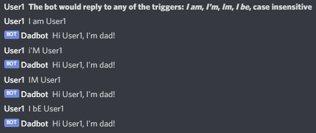
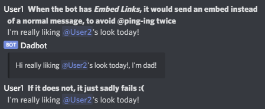
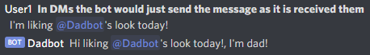

# Dadbot

A simple Discord bot that continues the dead `Hi X, I'm dad!` joke

# Installation

## 1. Clone this repo / download it somehow

## 2. Make a `config.json` file

### Fields

- `token` - Your bot token

### See example file [`config.example.json`](./config.example.json)

## 3. Install dependencies

Run `npm i` or use your favorite package manager

## 4. Run it

There are two available scripts:

- `start` for starting normally
- `test` for starting with [`nodemon`](https://github.com/remy/nodemon) (restart on file update)

# Examples

